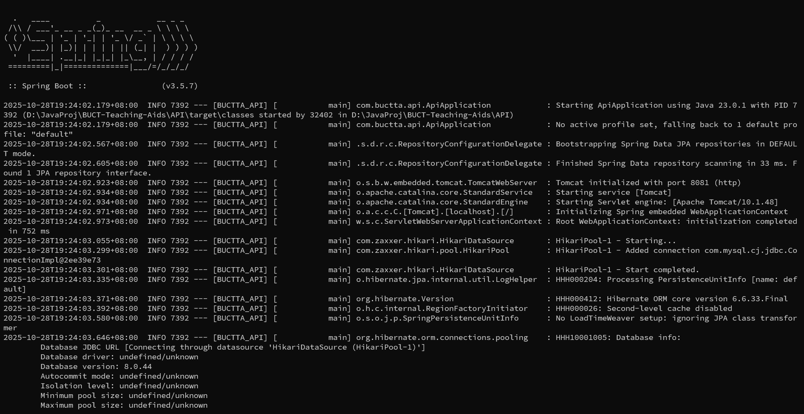
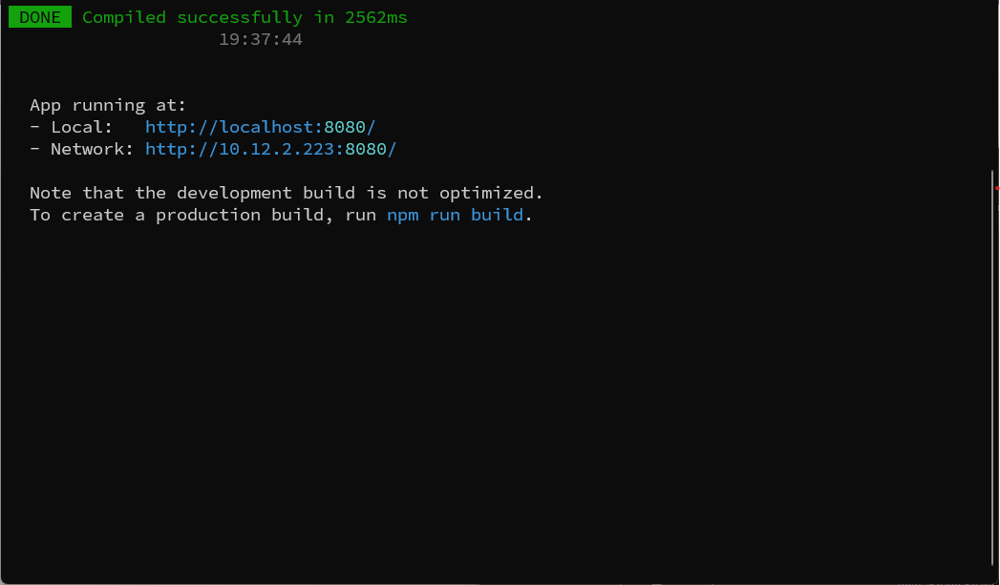

# 北化教学辅助系统

## 工作进度

**后台管理系统：完成前后端分离**
* 后端业务逻辑采用Java+SpringBoot框架，数据库采用MySQL
* 前端临时用Vue写了一个，设计图里提到的要素下一步实现。视图UI看UI组那边的进度了

> 其余项目组的进度，以后就在这里加就行

## 项目文件结构
* ***/API*** - 后端项目文件夹。使用Maven作为包管理器，后端项目组主要维护这一部分。
* ***/WebUI*** - 前端项目文件夹。 前端项目组主要维护这一部分。
* ***/Resources*** - 资源文件夹。主要存放备用文件（***/Backup***），文档和文档相关资源

## 后端接口指南
后端的根路由为 ***/api***，前端发送消息时根据目标路由来发送到指定的接口

> [后端接口文档](./Resources/Documents/README.md)

## 部署方法

### **1. 安装并配置Java** 

选择 ***[Java 21](https://www.oracle.com/java/technologies/javase/javase8u211-later-archive-downloads.html)*** 版本并进行下载安装。安装成功后，按如下方式编辑系统环境变量：

* 新建：JAVA_HOME，值：[Java安装路径]

* 修改：Path，添加值：%JAVA_HOME%\bin,%JAVA_HOME%\jre\bin

* 新建：ClassPath，值：.;%JAVA_HOME%\lib\dt.jar;%JAVA_HOME%\lib\tools.jar; 
  
完成后，启动命令行。输入命令```java --version```以验证是否安装成功

---
### **2. 安装并配置Maven**
下载 ***[Maven](https://maven.apache.org/download.cgi)*** 最新版。直接解压到合适的目录下后，按如下方式配置环境变量：

* 新建：MAVEN_HOME，值：[Maven解压路径]

* 修改：Path，添加值：%MAVEN_HOME%\bin

完成后，启动命令行。输入命令```mvn --version```以验证是否配置成功

---
### **3. 安装并配置MySQL**

选择 ***[MySQL 8.0.44 Community](https://dev.mysql.com/downloads/installer/)*** 版本并进行下载安装。只需安装组件 ***MySQL Server*** 和 ***MySQL Shell***。为方便起见可以选择安装 ***MySQL Workbench***。

> ***注意：安装过程中，会提示要求设置根用户密码。请务必将这个密码保存好***

安装完成后，启动 ***MySQL Command Line Client*** （不是 ***MySQL Shell*** ）。打开后界面会显示“Enter Password”，这是在要求你登录根用户，此时输入刚刚设置的根用户密码即可登录。

输入命令```create database [数据库名称]```创建数据库

输入命令```use [数据库名称]```进入数据库

输入如下代码:
```
CREATE TABLE admin_users
(
    id int(10) primary key NOT NULL AUTO_INCREMENT,
    username varchar(30) NOT NULL,
    password varchar(255) NOT NULL,
    UNIQUE (username)
);
```
即可创建一个新的数据表：```admin_user```，这个数据表用来存放后台管理员用户信息。

数据库创建完成后，进行如下工作：

* 打开项目文件夹下的 ***\AdminWeb\src\main\resources\application.properties*** 文件
  
  将```spring.datasource.username```的值改为```root```（默认已是这个值）

  将```spring.datasource.password```的值改为刚刚设置的数据库密码
  
  将```spring.datasource.url```的值改为```jdbc:mysql://localhost:3306/[数据库名称]?serverTimezone=UTC```

> *本项目默认的数据库名称为 BUCTTA_DATABASE，如果不想修改```spring.datasource.url```，那么请在创建数据库的时候把数据库名称设置为 BUCTTA_DATABASE*

---
### **4. 安装并配置Nodejs和Vue**
选择 ***[Nodejs 22.21.0](https://registry.npmmirror.com/binary.html?path=node/v22.21.0/)*** 版本并进行下载安装。注意安装过程中不要勾选“Automatically install the necessary tools”。安装完成后配置环境变量。配置过程相对复杂，在此不多赘述。可以参考[这篇文章](https://blog.csdn.net/AV_VA1/article/details/149789138)。

配置完成后，启动命令行。输入命令```node --version```或```npm --version```以验证Nodejs是否安装成功。

验证已经正确安装Nodejs后，输入```npm install -g @vue/cli```来安装Vue脚手架。

输入命令```vue --version```以验证Vue脚手架是否安装成功。

---
### **5. 启动并测试项目**
   
* 启动后端：打开命令行，进入\AdminWeb目录。输入命令```mvn spring-boot:run```,等到命令行能够一直保持并且不再弹出文本，说明启动成功。启动成功后不要关闭命令行窗口。（如下图所示）




* 启动前端：打开命令行，进入\WebView\adminwebview目录，输入命令```npm install```，完成后。再输入```npm run serve```等到命令行显示前端的本机访问地址，说明启动成功。启动成功后不要关闭命令行窗口。（如下图所示）



* 测试项目：访问前端命令行所给出的链接（默认为 ***localhost:8080*** 或 ***127.0.0.1:8080*** ），即可访问前端。在前端进行的登录，注册等操作，均会在后端产生相应（此时可以打开后端命令行查看）。

---
### **6. 更多说明**

* 后端默认跑在8081端口。如果想要更改端口，需要打开 ***\AdminWeb\src\main\resources\application.properties*** 文件，将```server.port```的值改为想要开放的端口即可。
* 后端端口被更改后，同样需要在前端更改连接到后端的端口。打开 ***\WebView\adminwebview\vue.config.js*** 文件，将其中```devServer:proxy```的```target```属性的值改成```http://localhost:[后端端口]```（具体可以参考文件内的注释）
* 前端默认跑在8080端口。如果想要更改端口，需要打开 ***\WebView\adminwebview\vue.config.js*** 文件，将```devServer:port```的值改为想要开放的端口即可。（具体可以参考文件内的注释）
