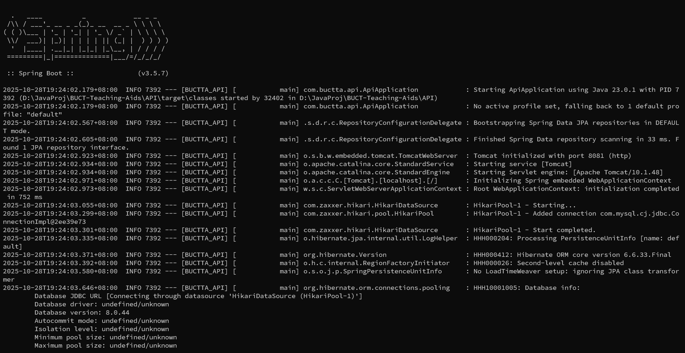

# 北化教学辅助系统

***生产环境主机***：10.15.2.38 (sjjx.buct.edu.cn)

***数据库名称：*** BUCTTA_DATABASE

## 开发框架简介
* 前端：经典HTML+js+css

* 后端：Java SpringBoot + Python Flask

* 数据库：MySQL - 持久化，Redis - 高并发情况下的中间缓存

## 注意：
为了便于开发和生产部署，现统一要求端口号在4000开放，并使用特定用户和特定密码供SpringBoot的访问,

1、[修改MySQL的服务端口为4000](https://blog.csdn.net/qq_43082279/article/details/127968082)

2、在自己的MySQL中执行如下代码：

```sql
CREATE USER 'java_springboot_buctta'@'localhost' IDENTIFIED BY '~springboot1794Zz!';
GRANT SELECT, INSERT, UPDATE, DELETE, CREATE, ALTER, INDEX, EXECUTE, SHOW VIEW 
    ON BUCTTA_DATABASE.* 
    TO 'java_springboot_buctta'@'localhost';
```
之后**java后端的application.properties就不要改了**

## 工作进度

**后台管理系统：完成前后端分离**

* 已实现课程相关的大多数功能
* 实现AI智能批改实验报告，前后端均已实现。
> 其余项目组的进度，以后就在这里加就行

## 项目文件结构
* ***API/JavaAPI*** - Java后端项目文件夹。
* ***API/PythonAPI*** - Python后端项目文件夹。
* ***API/src/main/resources/static*** - 前端项目文件夹。
* ***repositres*** - 资源文件夹。主要存放仓库文档相关资源

## 后端接口指南

> [后端接口文档](./repositres/Documents/README.md)

## 部署方法（Windows）

>推荐大家使用Linux系统对项目进行开发。对于Windows用户，将操作系统升级到专业版（用淘宝20块钱的Key）后，启用**WSL**(Windows Subsystem for Linux)功能，在WSL环境下进行开发，与Linux主系统体验是几乎一致的。同时在Windows里的IDE大多数也可以直接连接到WSL项目和WSL环境（如JetBrains系列，VSCode等），做到开发环境与主系统隔离，这样一来就易于管理项目，非常地方便。👍

### **1. 安装并配置Java** 

选择 ***[Java 23](https://www.oracle.com/java/technologies/javase/jdk23-archive-downloads.html)*** 版本并进行下载安装。安装成功后，按如下方式编辑系统环境变量：

* 新建：JAVA_HOME，值：[Java安装路径]

* 修改：Path，添加值：%JAVA_HOME%\bin,%JAVA_HOME%\jre\bin

* 新建：ClassPath，值：.;%JAVA_HOME%\lib\dt.jar;%JAVA_HOME%\lib\tools.jar; 
  
完成后，启动命令行。输入命令```java --version```以验证是否安装成功

---
### **2. 安装并配置Maven**
下载 ***[Maven](https://maven.apache.org/download.cgi)*** 最新版。直接解压到合适的目录下后，按如下方式配置环境变量：

* 新建：MAVEN_HOME，值：[Maven解压路径]

* 修改：Path，添加值：%MAVEN_HOME%\bin

完成后，启动命令行。输入命令```mvn --version```以验证是否配置成功

---
### **3. 安装并配置MySQL**

选择 ***[MySQL 8.0.44 Community](https://dev.mysql.com/downloads/installer/)*** 版本并进行下载安装。只需安装组件 ***MySQL Server*** 和 ***MySQL Shell***。为方便起见可以选择安装 ***MySQL Workbench***。

> ***注意：安装过程中，会提示要求设置根用户密码。请务必将这个密码保存好***

安装完成后，我们先[修改MySQL的服务端口为4000](https://blog.csdn.net/qq_43082279/article/details/127968082)。

修改完成后启动 ***MySQL Command Line Client*** （不是 ***MySQL Shell*** ）。打开后界面会显示“Enter Password”，这是在要求你登录根用户，此时输入刚刚设置的根用户密码即可登录。

输入命令```create database BUCTTA_DATABASE;```创建数据库

输入命令```use BUCTTA_DATABASE;```进入数据库

现在已经不需要创建数据表。Java项目采用Flyway组件来自动更新数据表，这样便于迁移。

---
### **4. 启动并测试项目**
   
* 启动后端：打开命令行，进入API目录。输入命令```mvn spring-boot:run```,等到命令行能够一直保持并且不再弹出文本，说明启动成功。启动成功后不要关闭命令行窗口。（如下图所示）




* 测试项目：使用IDE、ApiPost或Postman，向后端发送消息，查看响应

---
### **5. 构建项目并部署**

命令行进入API目录，输入```mvn clean package -DskipTests```

完成后会在当前目录的/target下生成一个 *BUCTTAAPI-0.0.1-SNAPSHOT.jar* 文件，进入这个目录，输入```nohup java -jar *BUCTTAAPI-0.0.1-SNAPSHOT.jar*```前端和后端即可同时启动，并且无需保留控制台。之后通过4444端口访问前端即可，后端的任何日志均会输出到当前目录下的一个 *nohup.out* 文件中
