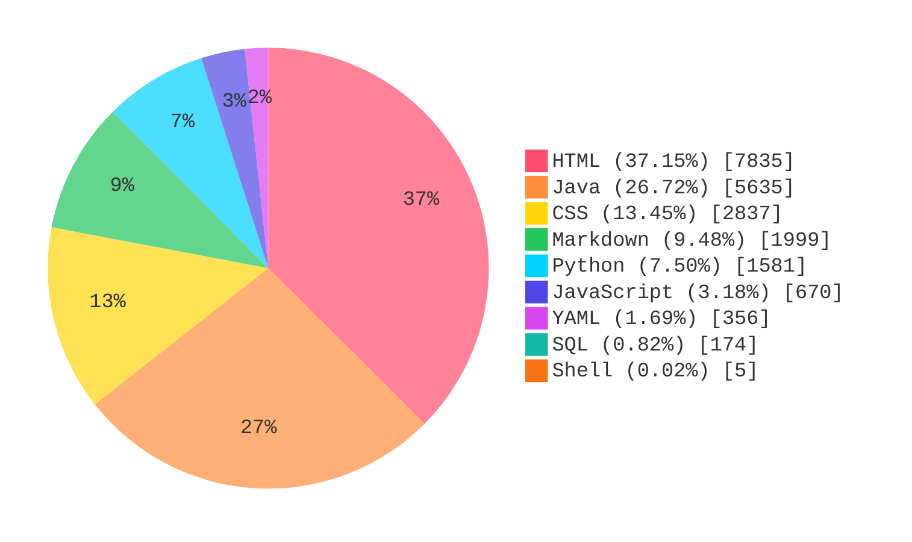

# 北化教学辅助系统

[](./LICENSE)
[](./README.md)


[](https://github.com/TheBadRoger/BUCT-Teaching-Aids/actions/workflows/ci.yml)
[](https://github.com/TheBadRoger/BUCT-Teaching-Aids/actions/workflows/ci.yml)


<!-- STATS_SECTION_START -->
## Project Statistics

> Updated (UTC): `2026-04-01T13:16:37Z`

### Core Metrics

| Metric | Value |
| :-- | --: |
| Total Lines (Non-empty) | 21092 |
| Java API Endpoints | 53 |
| Python API Endpoints | 27 |

### Language Distribution


```mermaid
%%{init: {'theme':'base','themeVariables': {
  'fontFamily': 'Fira Code, JetBrains Mono, Source Code Pro, Cascadia Code, Menlo, Consolas, monospace',
  'pieStrokeColor': 'transparent',
  'pieStrokeWidth': '0px',
  'pieOuterStrokeWidth': '0px',
  'pie1': '#FF4D6D',
  'pie2': '#FF8E3C',
  'pie3': '#FFD60A',
  'pie4': '#22C55E',
  'pie5': '#00D1FF',
  'pie6': '#4F46E5',
  'pie7': '#D946EF',
  'pie8': '#14B8A6',
  'pie9': '#F97316',
  'pie10': '#A855F7'
}}}%%
pie showData
    "HTML (37.15%)" : 7835
    "Java (26.72%)" : 5635
    "CSS (13.45%)" : 2837
    "Markdown (9.48%)" : 1999
    "Python (7.50%)" : 1581
    "JavaScript (3.18%)" : 670
    "YAML (1.69%)" : 356
    "SQL (0.82%)" : 174
    "Shell (0.02%)" : 5
```
<!-- STATS_SECTION_END -->

## 开发框架简介
* 前端：经典HTML+js+css

* 后端：Java SpringBoot + Python Flask

* 数据库：MySQL - 持久化，Redis - 高并发情况下的中间缓存

## 注意：
为了便于开发和生产部署，现统一要求端口号在4000开放，并使用特定用户和特定密码供SpringBoot的访问,

1、[修改MySQL的服务端口为3306](https://blog.csdn.net/qq_43082279/article/details/127968082)
> 默认情况下就是3306，如果之前改过了需要改回来

2、在自己的MySQL中执行如下代码：

```sql
CREATE DATABASE IF NOT EXISTS BUCTTA_DATABASE;
CREATE USER 'java_springboot_buctta'@'localhost' IDENTIFIED BY '${BUCTTA_JAVA_DB_PASSWORD}';
GRANT SELECT, INSERT, UPDATE, DELETE, CREATE, ALTER, INDEX, EXECUTE, SHOW VIEW 
    ON BUCTTA_DATABASE.* 
    TO 'java_springboot_buctta'@'localhost';
```
* 之后**java后端的application.properties就不要改了**

## 工作进度

**后台管理系统：完成前后端分离**

* 已实现课程相关的大多数功能
* 实现AI智能批改实验报告，前后端均已实现。
> 其余项目组的进度，以后就在这里加就行

## 项目文件结构
由于我们有Java和Python两个后端，这两个后端都支持 **前后端合并部署**，所以两个部分的前端要分开

* ***API/JavaAPI/src/*** - Java后端文件夹
* ***API/JavaAPI/src/resources/static/*** - 与Java后端合并部署的前端文件夹
* ***API/PythonAPI/*** - Python后端文件夹
* ***API/PythonAPI/static*** - 与Python后端合并部署的前端css，js文件夹
* ***API/PythonAPI/templates*** - 与Python后端合并部署的前端html网页文件夹
* ***repositres*** - 仓库文档相关资源文件夹

## 文档

||||
|:-:|:-:|:-:
|后端接口文档|[Java](./repositres/Documents/JavaAPIDoc.md)|[Python](./repositres/Documents/PythonAPIDoc.md)|
|Java后端部署方法|[Windows](./repositres/Documents/java_deploy_win.md)|[Ubuntu Linux](./repositres/Documents/java_deploy_linux.md)|
|Python后端部署方法| - |[Ubuntu Linux](./repositres/Documents/python_deploy_linux.md)|
|Docker部署方法|[Docker](./repositres/Documents/docker_deploy.md)|-|

> [Python后端项目详解](./repositres/Documents/python_api_intro.md)
