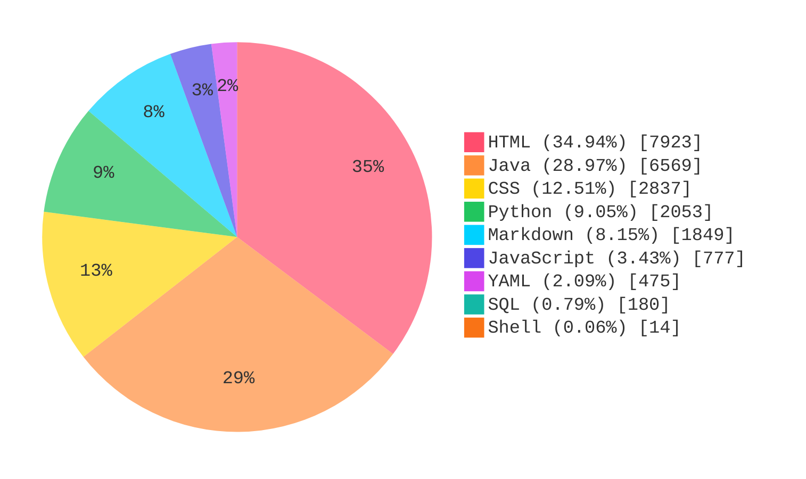

# 北化教学辅助系统

  <strong>项目信息</strong> 
  
  
  
  
  
  
    
  <strong>代码统计</strong> 
  
  
  
    
  <strong>CI状态</strong> 
  
  
  

<!-- STATS_SECTION_START -->
## 项目统计

> 统计更新时间（UTC+8）：`2026-04-14 12:44:42`

### 核心统计

| 指标 | 数值 |
| :-- | --: |
| 代码总行数（非空行） | 22677 |
| Java 接口数 | 55 |
| Python 接口数 | 27 |
| Java 单元测试用例数 | 129 |
| Python 单元测试用例数 | 28 |

### 语言占比图

```mermaid
%%{init: {'theme':'base','themeVariables': {
  'fontFamily': 'Fira Code, JetBrains Mono, Source Code Pro, Cascadia Code, Menlo, Consolas, monospace',
  'pieStrokeColor': 'transparent',
  'pieStrokeWidth': '0px',
  'pieOuterStrokeWidth': '0px',
  'pie1': '#FF4D6D',
  'pie2': '#FF8E3C',
  'pie3': '#FFD60A',
  'pie4': '#22C55E',
  'pie5': '#00D1FF',
  'pie6': '#4F46E5',
  'pie7': '#D946EF',
  'pie8': '#14B8A6',
  'pie9': '#F97316',
  'pie10': '#A855F7'
}}}%%
pie showData
    "HTML (34.94%)" : 7923
    "Java (28.97%)" : 6569
    "CSS (12.51%)" : 2837
    "Python (9.05%)" : 2053
    "Markdown (8.15%)" : 1849
    "JavaScript (3.43%)" : 777
    "YAML (2.09%)" : 475
    "SQL (0.79%)" : 180
    "Shell (0.06%)" : 14
```
<!-- STATS_SECTION_END -->

## 开发框架简介

- 前端：经典HTML+js+css

- 后端：Java SpringBoot + Python Flask

- 数据库：MySQL - 持久化，Redis - 高并发情况下的中间缓存

## 工作进度

**后台管理系统：完成前后端分离**

- 已实现课程相关的大多数功能
- 实现AI智能批改实验报告，前后端均已实现。

> 其余项目组的进度，以后就在这里加就行

## 项目文件结构

由于我们有Java和Python两个后端，这两个后端都支持 **前后端合并部署**，所以两个部分的前端要分开

- **_API/JavaAPI/src/_** - Java后端文件夹
- **_API/JavaAPI/src/resources/static/_** - 与Java后端合并部署的前端文件夹
- **_API/PythonAPI/_** - Python后端文件夹
- **_API/PythonAPI/static_** - 与Python后端合并部署的前端css，js文件夹
- **_API/PythonAPI/templates_** - 与Python后端合并部署的前端html网页文件夹
- **_documents_** - 仓库文档相关资源文件夹

## 文档

|                   后端接口文档                   |                              后端部署方法                              |                     后端项目介绍                     |
| :----------------------------------------------: | :--------------------------------------------------------------------: | :--------------------------------------------------: |
|   [Java](documents/java_apidoc.md)   |      [Windows - Java](documents/java_deploy_win.md)       | [Java](documents/java_api_intro.md) |
| [Python](documents/python_apidoc.md) |   [Ubuntu Linux - Java](documents/java_deploy_linux.md)   | [Python](documents/python_api_intro.md) |
|                        -                         | [Ubuntu Linux - Python](documents/python_deploy_linux.md) | - |
|                        -                         |           [Docker](documents/docker_deploy.md)            | - |
