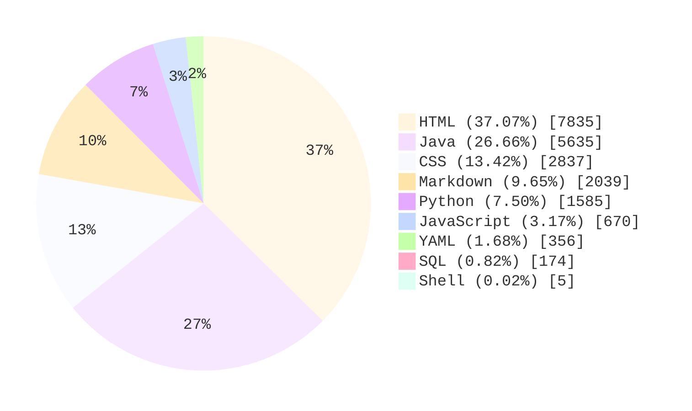

# 北化教学辅助系统

[](./README.md)


[](https://github.com/TheBadRoger/BUCT-Teaching-Aids/actions/workflows/ci.yml)
[](https://github.com/TheBadRoger/BUCT-Teaching-Aids/actions/workflows/ci.yml)


***生产环境主机***：10.14.48.76

***数据库名称：*** BUCTTA_DATABASE

## 开发框架简介
* 前端：经典HTML+js+css

* 后端：Java SpringBoot + Python Flask

* 数据库：MySQL - 持久化，Redis - 高并发情况下的中间缓存

## 注意：
为了便于开发和生产部署，现统一要求端口号在4000开放，并使用特定用户和特定密码供SpringBoot的访问,

1、[修改MySQL的服务端口为3306](https://blog.csdn.net/qq_43082279/article/details/127968082)
> 默认情况下就是3306，如果之前改过了需要改回来

2、在自己的MySQL中执行如下代码：

```sql
CREATE DATABASE IF NOT EXISTS BUCTTA_DATABASE;
CREATE USER 'java_springboot_buctta'@'localhost' IDENTIFIED BY '${BUCTTA_JAVA_DB_PASSWORD}';
GRANT SELECT, INSERT, UPDATE, DELETE, CREATE, ALTER, INDEX, EXECUTE, SHOW VIEW 
    ON BUCTTA_DATABASE.* 
    TO 'java_springboot_buctta'@'localhost';
```
* 之后**java后端的application.properties就不要改了**

## 工作进度

**后台管理系统：完成前后端分离**

* 已实现课程相关的大多数功能
* 实现AI智能批改实验报告，前后端均已实现。
> 其余项目组的进度，以后就在这里加就行

## 项目文件结构
由于我们有Java和Python两个后端，这两个后端都支持 **前后端合并部署**，所以两个部分的前端要分开

* ***API/JavaAPI/src/*** - Java后端文件夹
* ***API/JavaAPI/src/resources/static/*** - 与Java后端合并部署的前端文件夹
* ***API/PythonAPI/*** - Python后端文件夹
* ***API/PythonAPI/static*** - 与Python后端合并部署的前端css，js文件夹
* ***API/PythonAPI/templates*** - 与Python后端合并部署的前端html网页文件夹
* ***repositres*** - 仓库文档相关资源文件夹

<!-- STATS_SECTION_START -->
## 项目统计

> 统计更新时间（UTC）：`2026-04-01T12:15:38Z`

### 核心统计

| 指标 | 数值 |
| :-- | --: |
| 代码总行数（非空行） | 21136 |
| 语言数量 | 9 |
| 使用最多的语言 | HTML |
| Java 接口数 | 53 |
| Python 接口数 | 27 |

### 各语言代码行数

| 语言 | 行数 | 占比 |
| :-- | --: | --: |
| HTML | 7835 | 37.07% |
| Java | 5635 | 26.66% |
| CSS | 2837 | 13.42% |
| Markdown | 2039 | 9.65% |
| Python | 1585 | 7.50% |
| JavaScript | 670 | 3.17% |
| YAML | 356 | 1.68% |
| SQL | 174 | 0.82% |
| Shell | 5 | 0.02% |

### 语言占比图


```mermaid
%%{init: {'theme':'base','themeVariables': {
  'fontFamily': 'JetBrains Mono, Fira Code, Consolas, monospace',
  'pieStrokeColor': 'transparent',
  'pieStrokeWidth': '0px',
  'pieOuterStrokeWidth': '0px'
}}}%%
pie showData
    "HTML (37.07%)" : 7835
    "Java (26.66%)" : 5635
    "CSS (13.42%)" : 2837
    "Markdown (9.65%)" : 2039
    "Python (7.50%)" : 1585
    "JavaScript (3.17%)" : 670
    "YAML (1.68%)" : 356
    "SQL (0.82%)" : 174
    "Shell (0.02%)" : 5
```
<!-- STATS_SECTION_END -->

## 文档

||||
|:-:|:-:|:-:
|后端接口文档|[Java](./repositres/Documents/JavaAPIDoc.md)|[Python](./repositres/Documents/PythonAPIDoc.md)|
|Java后端部署方法|[Windows](./repositres/Documents/java_deploy_win.md)|[Ubuntu Linux](./repositres/Documents/java_deploy_linux.md)|
|Python后端部署方法| - |[Ubuntu Linux](./repositres/Documents/python_deploy_linux.md)|
|Docker部署方法|[Docker](./repositres/Documents/docker_deploy.md)|-|

> [Python后端项目详解](./repositres/Documents/python_api_intro.md)
