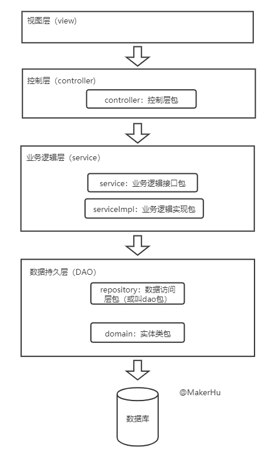

# SpringBoot后端怎么写？

* 一个前端-后端-数据库的完整项目结构示意图如下：



其中，最上方的“**视图层**”指的就是**前端**，在**后端**开发中，我们无需在意这一部分。

剩下的部分就是后端开发需要完成的任务。我们运用 **[自底向上](https://baike.baidu.com/item/%E8%87%AA%E5%BA%95%E5%90%91%E4%B8%8A/56623454)** 的思维，来一步一步分析我们的项目。

现以“实现用户登录的后端业务逻辑”为目标来作为我们的教程案例

## 分析与代码实现

数据库搭建好后，首先需要经过“ **数据持久层**”，这一层负责把数据从数据库中提取出来，再存储到服务用的对象实例里。通俗的比喻，就是把仓库里存的米面粮油肉菜，拿出来摆在桌子上准备好。

对于实现用户登录这个目标，最简单的用户就包含用户名和密码两项数据。除此之外，为了方便后端与数据库的交互，还需要预留一个整数字段：id作为主键。于是我们数据库里的数据表有 *id*，*username*和*password* 三列。

这样一来，我们只需要创建一个 *User* 类，类中只需要包含 *id*, *username* 和 *password* 三个私有成员变量即可。
```Java
//在entities/User.java中：
@Table(name= "users“)
@Entity
public class Users{
    @Id //用于后端进行识别
    @GeneratedValue(strategy = GenerationType.IDENTITY)
    private long id;
    private String username;
    private String password;
    //get，set方法...
}
```
关注```@Table```和```@Entity```这两个注解。```@Table```表示这个类承接的数据来自于哪个数据表，```@Entity```将这个类视为能够承接数据的实体。

除了成员变量，还要在成员函数中定义公开的get和set方法，部分IDE可以直接一键生成，如果要手写的话就需要函数名遵循 *getXXX* 和 *setXXX* 的命名规则，“*XXX*”是每一个私有成员变量名的首字母大写形式。getXXX里写return XXX，set函数里写this.XXX=参数。意思就是getXXX返回对应的值，setXXX修改对应的值。

这样一来，一个实体就有了。下一步是创建实体和数据库之间的通信。