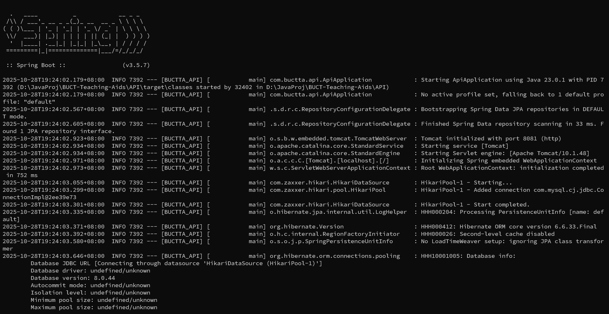

# 部署方法（Windows）

>推荐大家使用Linux系统对项目进行开发([Linux系统部署方法](installl_linux.md))。对于Windows用户，将操作系统升级到专业版（用淘宝20块钱的Key）后，启用**WSL**(Windows Subsystem for Linux)功能，在WSL环境下进行开发，与Linux主系统体验是几乎一致的。同时在Windows里的IDE大多数也可以直接连接到WSL项目和WSL环境（如JetBrains系列，VSCode等），做到开发环境与主系统隔离，这样一来就易于管理项目，非常地方便。👍

## **1. 安装并配置Java** 

选择 ***[Java 25](https://jdk.java.net/25/)*** JDK（这里是建议使用的OpenJDK）并进行下载安装。安装成功后，按如下方式编辑系统环境变量：

* 新建：JAVA_HOME，值：[Java安装路径]

* 修改：Path，添加值：%JAVA_HOME%\bin,%JAVA_HOME%\jre\bin

* 新建：ClassPath，值：.;%JAVA_HOME%\lib\dt.jar;%JAVA_HOME%\lib\tools.jar; 
  
完成后，启动命令行。输入命令```java --version```以验证是否安装成功

## **2. 安装并配置Maven**
下载 ***[Maven](https://maven.apache.org/download.cgi)*** 最新版。直接解压到合适的目录下后，按如下方式配置环境变量：

* 新建：MAVEN_HOME，值：[Maven解压路径]

* 修改：Path，添加值：%MAVEN_HOME%\bin

完成后，启动命令行。输入命令```mvn --version```以验证是否配置成功

## **3. 安装并配置MySQL**

选择 ***[MySQL 8.0.44 Community](https://dev.mysql.com/downloads/installer/)*** 版本并进行下载安装。只需安装组件 ***MySQL Server*** 和 ***MySQL Shell***。为方便起见可以选择安装 ***MySQL Workbench***。

> ***注意：安装过程中，会提示要求设置根用户密码。请务必将这个密码保存好***

安装完成后，我们先[修改MySQL的服务端口为4000](https://blog.csdn.net/qq_43082279/article/details/127968082)。

修改完成后启动 ***MySQL Command Line Client*** （不是 ***MySQL Shell*** ）。打开后界面会显示“Enter Password”，这是在要求你登录根用户，此时输入刚刚设置的根用户密码即可登录。

输入命令```create database BUCTTA_DATABASE;```创建数据库

输入命令```use BUCTTA_DATABASE;```进入数据库

现在已经不需要创建数据表。Java项目采用Flyway组件来自动更新数据表，这样便于迁移。

## **4. 安装Redis**
直接访问redis的[开源仓库](https://github.com/tporadowski/redis/releases)，可选zip或msi安装包。zip安装需要配置环境变量，msi安装则根据指引完成即可，具体请自己搜索安装方法


## **5. 启动并测试项目**
   
* 启动后端：打开命令行，进入API目录。输入命令```mvn spring-boot:run```,等到命令行能够一直保持并且不再弹出文本，说明启动成功。启动成功后不要关闭命令行窗口。（如下图所示）




* 测试项目：编写单元测试，会在运行和调试时得到测试结果；或者构建并启动项目后使用IDE、ApiPost或Postman，向后端发送消息，查看响应

---
* 注意 开发环境中，应该将application.properties文件中的```spring.profiles.active```字段设置为```dev```；生产环境中则为```prod```
