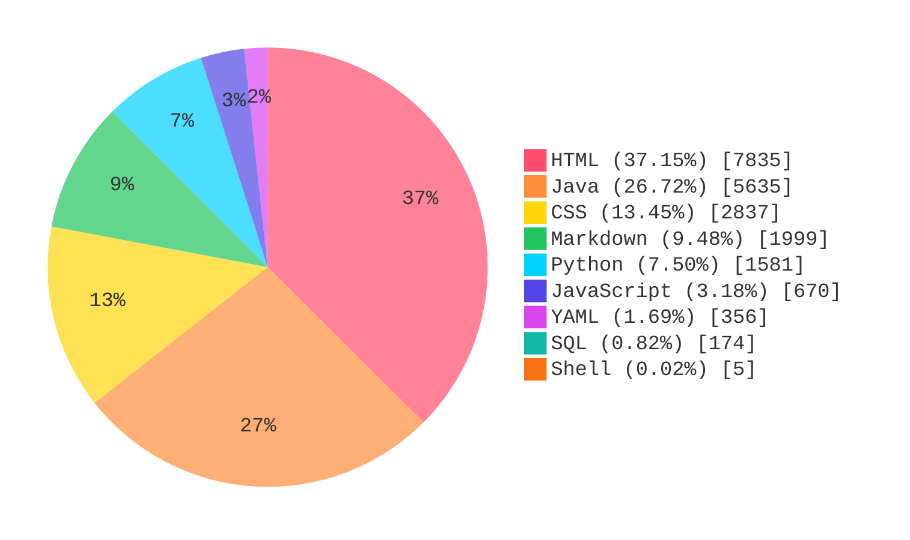

## Project Statistics

> Updated (UTC): `2026-04-01T13:16:37Z`

### Core Metrics

| Metric | Value |
| :-- | --: |
| Total Lines (Non-empty) | 21092 |
| Java API Endpoints | 53 |
| Python API Endpoints | 27 |

### Language Distribution

