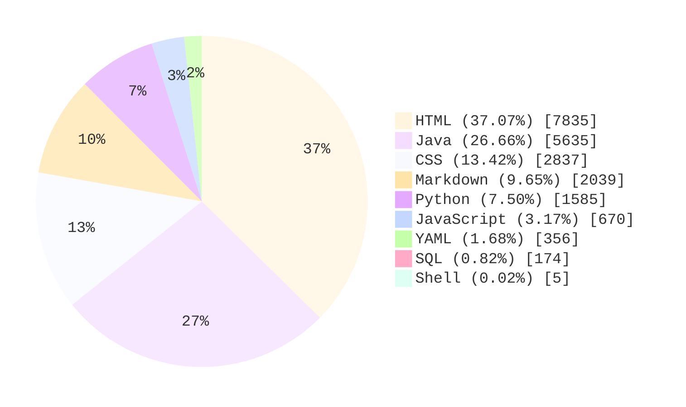

## 项目统计

> 统计更新时间（UTC）：`2026-04-01T12:15:38Z`

### 核心统计

| 指标 | 数值 |
| :-- | --: |
| 代码总行数（非空行） | 21136 |
| 语言数量 | 9 |
| 使用最多的语言 | HTML |
| Java 接口数 | 53 |
| Python 接口数 | 27 |

### 各语言代码行数

| 语言 | 行数 | 占比 |
| :-- | --: | --: |
| HTML | 7835 | 37.07% |
| Java | 5635 | 26.66% |
| CSS | 2837 | 13.42% |
| Markdown | 2039 | 9.65% |
| Python | 1585 | 7.50% |
| JavaScript | 670 | 3.17% |
| YAML | 356 | 1.68% |
| SQL | 174 | 0.82% |
| Shell | 5 | 0.02% |

### 语言占比图

