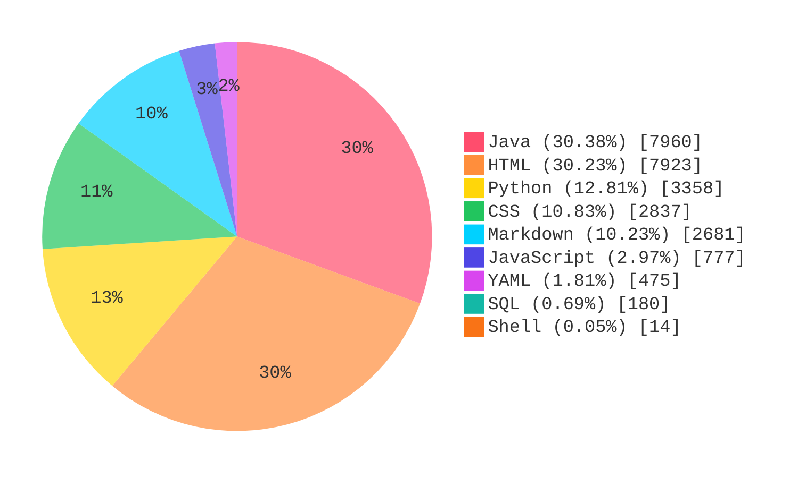

## 项目统计

> 统计更新时间（UTC+8）：`2026-06-22 13:07:35`

### 核心统计

| 指标 | 数值 |
| :-- | --: |
| 代码总行数（非空行） | 26205 |
| Java 接口数 | 85 |
| Python 接口数 | 36 |
| Java 单元测试用例数 | 129 |
| Python 单元测试用例数 | 48 |

### 语言占比图

