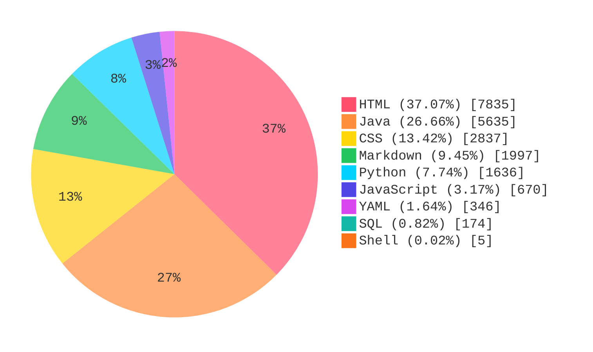

## 项目统计

> 统计更新时间（UTC+8）：`2026-04-03 00:01:52`

### 核心统计

| 指标 | 数值 |
| :-- | --: |
| 代码总行数（非空行） | 21135 |
| Java 接口数 | 53 |
| Python 接口数 | 27 |

### 语言占比图

```mermaid
%%{init: {'theme':'base','themeVariables': {
  'fontFamily': 'Fira Code, JetBrains Mono, Source Code Pro, Cascadia Code, Menlo, Consolas, monospace',
  'pieStrokeColor': 'transparent',
  'pieStrokeWidth': '0px',
  'pieOuterStrokeWidth': '0px',
  'pie1': '#FF4D6D',
  'pie2': '#FF8E3C',
  'pie3': '#FFD60A',
  'pie4': '#22C55E',
  'pie5': '#00D1FF',
  'pie6': '#4F46E5',
  'pie7': '#D946EF',
  'pie8': '#14B8A6',
  'pie9': '#F97316',
  'pie10': '#A855F7'
}}}%%
pie showData
    "HTML (37.07%)" : 7835
    "Java (26.66%)" : 5635
    "CSS (13.42%)" : 2837
    "Markdown (9.45%)" : 1997
    "Python (7.74%)" : 1636
    "JavaScript (3.17%)" : 670
    "YAML (1.64%)" : 346
    "SQL (0.82%)" : 174
    "Shell (0.02%)" : 5
```
