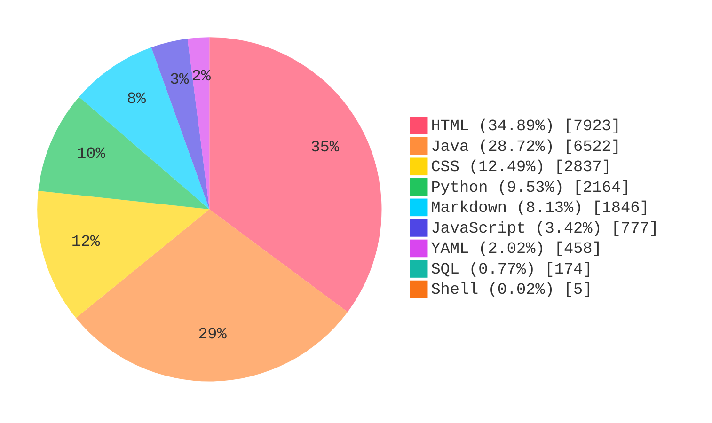

## 项目统计

> 统计更新时间（UTC+8）：`2026-04-06 00:27:38`

### 核心统计

| 指标 | 数值 |
| :-- | --: |
| 代码总行数（非空行） | 22706 |
| Java 接口数 | 55 |
| Python 接口数 | 27 |
| Java 单元测试用例数 | 128 |
| Python 单元测试用例数 | 28 |

### 语言占比图

