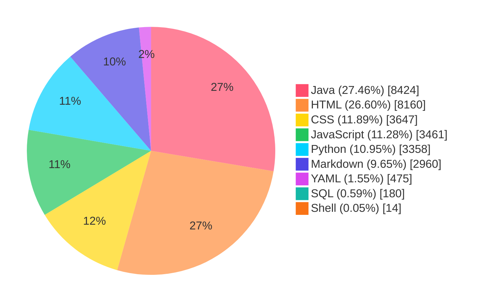

## 项目统计

> 统计更新时间（UTC+8）：`2026-08-16 10:57:07`

### 核心统计

| 指标 | 数值 |
| :-- | --: |
| 代码总行数（非空行） | 30679 |
| Java 接口数 | 93 |
| Python 接口数 | 36 |
| Java 单元测试用例数 | 129 |
| Python 单元测试用例数 | 48 |

### 语言占比图

```mermaid
%%{init: {'theme':'base','themeVariables': {
  'fontFamily': 'Fira Code, JetBrains Mono, Source Code Pro, Cascadia Code, Menlo, Consolas, monospace',
  'pieStrokeColor': 'transparent',
  'pieStrokeWidth': '0px',
  'pieOuterStrokeWidth': '0px',
  'pie1': '#FF4D6D',
  'pie2': '#FF8E3C',
  'pie3': '#FFD60A',
  'pie4': '#22C55E',
  'pie5': '#00D1FF',
  'pie6': '#4F46E5',
  'pie7': '#D946EF',
  'pie8': '#14B8A6',
  'pie9': '#F97316',
  'pie10': '#A855F7'
}}}%%
pie showData
    "Java (27.46%)" : 8424
    "HTML (26.60%)" : 8160
    "CSS (11.89%)" : 3647
    "JavaScript (11.28%)" : 3461
    "Python (10.95%)" : 3358
    "Markdown (9.65%)" : 2960
    "YAML (1.55%)" : 475
    "SQL (0.59%)" : 180
    "Shell (0.05%)" : 14
```
