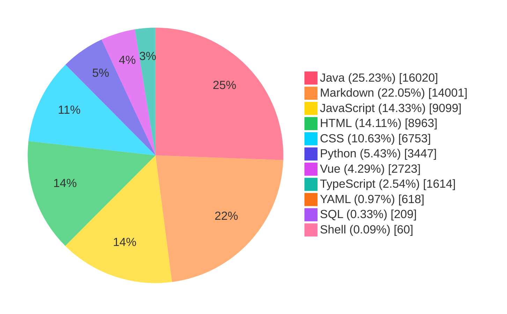

## 项目统计

> 统计更新时间（UTC+8）：`2026-10-24 13:46:17`

### 核心统计

| 指标 | 数值 |
| :-- | --: |
| 代码总行数（非空行） | 63507 |
| Java 接口数 | 142 |
| Python 接口数 | 36 |
| Java 单元测试用例数 | 278 |
| Python 单元测试用例数 | 48 |

### 语言占比图

```mermaid
%%{init: {'theme':'base','themeVariables': {
  'fontFamily': 'Fira Code, JetBrains Mono, Source Code Pro, Cascadia Code, Menlo, Consolas, monospace',
  'pieStrokeColor': 'transparent',
  'pieStrokeWidth': '0px',
  'pieOuterStrokeWidth': '0px',
  'pie1': '#FF4D6D',
  'pie2': '#FF8E3C',
  'pie3': '#FFD60A',
  'pie4': '#22C55E',
  'pie5': '#00D1FF',
  'pie6': '#4F46E5',
  'pie7': '#D946EF',
  'pie8': '#14B8A6',
  'pie9': '#F97316',
  'pie10': '#A855F7'
}}}%%
pie showData
    "Java (25.23%)" : 16020
    "Markdown (22.05%)" : 14001
    "JavaScript (14.33%)" : 9099
    "HTML (14.11%)" : 8963
    "CSS (10.63%)" : 6753
    "Python (5.43%)" : 3447
    "Vue (4.29%)" : 2723
    "TypeScript (2.54%)" : 1614
    "YAML (0.97%)" : 618
    "SQL (0.33%)" : 209
    "Shell (0.09%)" : 60
```
